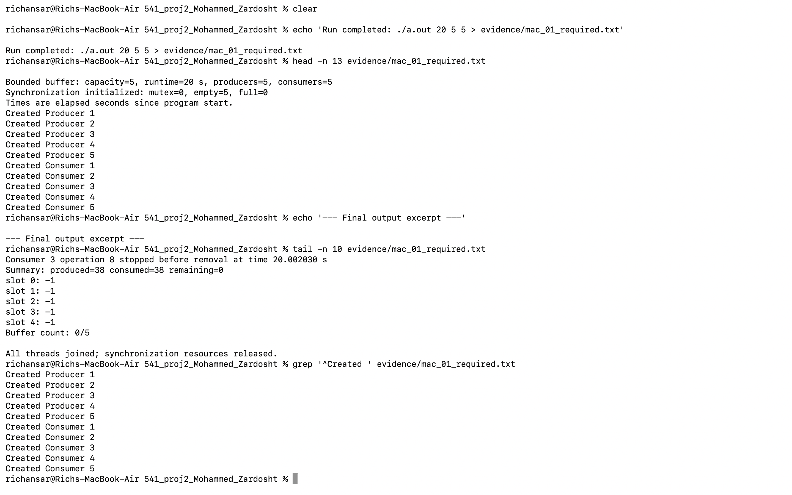
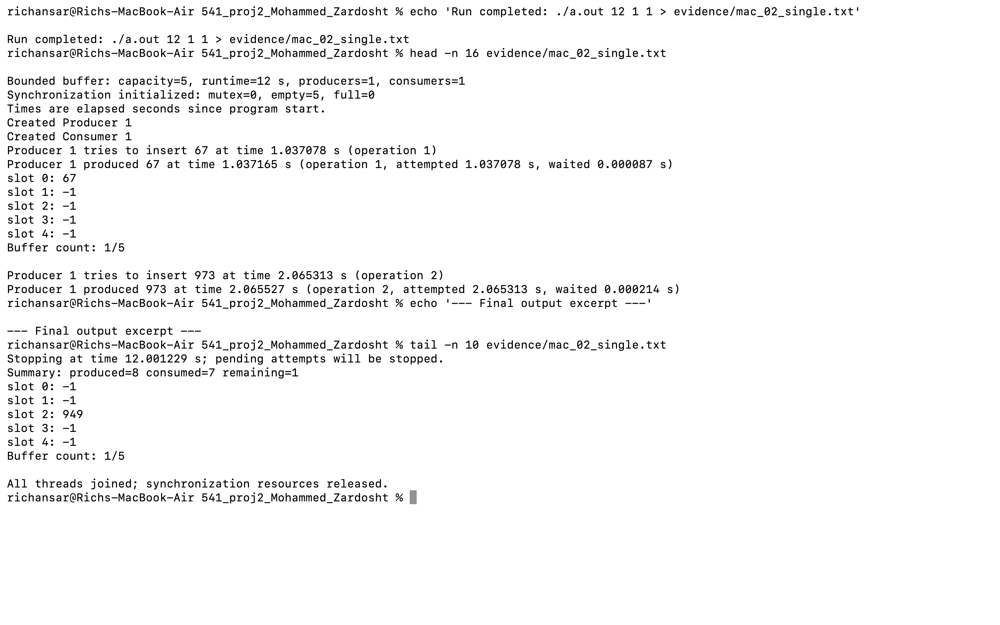
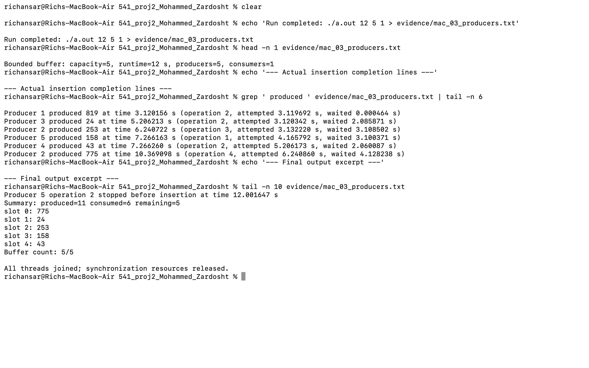
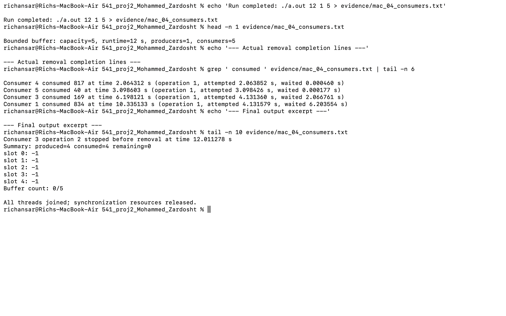
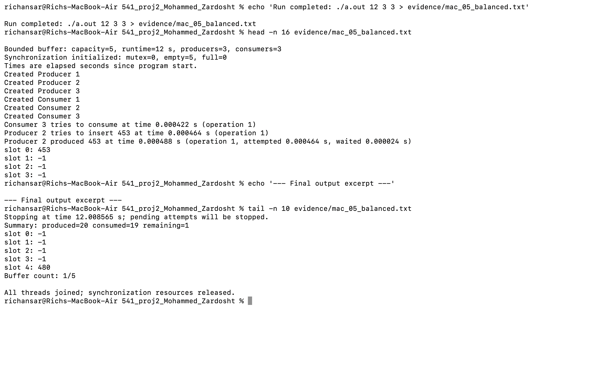

# CSC 541 — Programming Project 2

**Rounded Buffer Problem (bounded circular buffer), P-40**  
**Team:** Shazan Ansar Mohammed and Saina Zardosht  
**Submission:** `541_proj2_Mohammed_Zardosht.zip`  
**Due:** October 13, 2026, 11:59 p.m., as stated in the assignment

## What the program does

Several producers and consumers share a circular buffer with five slots.
Producers generate integers from 0 through 1000. Consumers remove the oldest
available item. A slot containing `-1` is empty. The program runs for the
requested number of seconds, stops the workers, and prints a final summary.

`buffer.c` completes the instructor's `insert_item()` and `remove_item()` and
adds the two extra-credit features. It also fixes the consumer's print
statement, supplies missing headers, checks command-line arguments, and joins
threads before releasing synchronization resources.

## Compile and run

Use a C11 compiler and POSIX threads. In Terminal, change into this folder:

```sh
cc -std=c11 -Wall -Wextra -Wpedantic -pthread buffer.c -o a.out
./a.out 20 5 5
```

The three arguments are **run duration in seconds**, **number of producers**,
and **number of consumers**, in that order. The required redirected run is:

```sh
./a.out 20 5 5 > output.txt
cat output.txt
```

The redirection sends output to the file, so Terminal remains quiet until the
program finishes. That is expected. `make` also builds the program; `make clean`
removes the executable. Build the executable on the machine where it will run.

The accepted duration is 1–86400 seconds; each thread count is 1–128.
Missing, nonnumeric, zero, negative, or out-of-range arguments produce a usage
message and a nonzero exit status. Both roles must have at least one thread.

On Linux the program uses `sem_init()` for unnamed semaphores. On macOS it
uses `sem_open()` for named POSIX semaphores, unlinks the names immediately
after opening, and closes the handles after the threads finish. Both paths use
`sem_wait()`, `sem_post()`, and the same `pthread_mutex_t` lock. The macOS path
avoids Apple's deprecated unnamed-semaphore initialization API. The named
path was tested on Linux; all five Mac configurations passed log verification.

## How synchronization works

| Resource | Initial value | Purpose |
| --- | --- | --- |
| `empty` | 5 | Reserve an empty slot before insertion |
| `full` | 0 | Reserve an available item before removal |
| `mutex` | Unlocked | Protect the buffer, pointers, counts, and output blocks |

Insertion waits on `empty`, locks `mutex`, writes at `insertPointer`, advances
the pointer modulo five, prints the updated buffer, unlocks, and posts `full`.
Removal waits on `full`, locks `mutex`, reads at `removePointer`, marks that
slot `-1`, advances the pointer modulo five, prints the updated buffer,
unlocks, and posts `empty`.

The semaphore wait comes **before** the mutex lock. Otherwise a producer
could hold the mutex while waiting for space and prevent a consumer from
freeing a slot. Similarly, a consumer must not hold the mutex while waiting
for an item.

The two circular pointers preserve FIFO order and reuse all five positions.
The lock prevents concurrent changes to the shared state. The output lock also
keeps each operation and its five-slot snapshot together, so another thread's
message does not appear in the middle of that snapshot.

## Extra credit

**Specific thread IDs.** The main thread assigns Producer 1 through Producer
N and Consumer 1 through Consumer M. These are stable logical IDs, not OS
thread numbers. A role and its number uniquely identify a worker throughout
the run. Each message carries that identity, and startup lists every worker.

**Attempt and completion times.** Every thread uses `CLOCK_MONOTONIC` relative
to the same start time. An attempt is recorded immediately before entering
the buffer operation. Completion is recorded after the buffer change while
holding the mutex. Each completed operation prints both times and their
difference. An operation number connects a thread's attempt to its completion.
Times are printed to six decimal places; this formatting does not claim
microsecond hardware accuracy.

For example, this is a real line from the producer-heavy test:

```text
Producer 4 produced 499 at time 10.008942 s (operation 1, attempted 4.004317 s, waited 6.004625 s)
```

The exact item values, scheduling, and times vary on each run. The output
retains the sample's producer/consumer messages and `slot 0` through `slot 4`
snapshots, while adding identity, timing, occupancy, and a final summary.

## Shutdown and return values

When the duration expires, main sets the stop flag while holding the mutex.
It posts enough semaphore wakeups for waiting workers to finish. These
additional posts are **shutdown signals**, not inserted items. A worker checks
the stop flag under the lock before touching the buffer, so a shutdown wakeup
cannot insert into a full buffer or remove from an empty one. Sleeping workers
check the flag between short sleep intervals. Main joins every worker before
closing/destroying the semaphores and destroying the mutex.

A pending operation reports that it stopped before insertion or removal. It
has no successful completion time because no buffer change occurred. Some
items may remain in the buffer at the end of the timed run. The final summary
must satisfy `produced - consumed = remaining`; remaining stays between 0 and 5.
Cleanup can add a short delay after the requested runtime.

`insert_item()` and `remove_item()` return 0 for success and 1 when shutdown
prevents completion. Removal prints the item and returns a status; it does not
return the item as a status because 0 is a valid item. Synchronization or
thread-creation failures print an error and end with failure.

## Team contributions

| Member | Completed contribution |
| --- | --- |
| Shazan Ansar Mohammed | Ran the five Mac configurations and log verification, captured five Terminal screenshots, and managed project files with AI guidance. |
| Saina Zardosht | Team member; no separate completed technical contribution has been reported. |

ChatGPT prepared the implementation and documentation. Assistance is disclosed in `genai.txt`.

## Experiments and evidence

Five real executions were completed in the preparation environment on Linux.
Full, unedited program output is stored in `evidence/`. The table below records
the actual results from those runs; these are not predictions for a later run.

| Run | Command | Produced | Consumed | Remaining | Peak occupancy | Longest producer wait | Longest consumer wait |
| --- | --- | ---: | ---: | ---: | ---: | ---: | ---: |
| Required configuration | `./a.out 20 5 5` | 46 | 42 | 4 | 5 | 2.001714 s | 1.000795 s |
| One producer, one consumer | `./a.out 12 1 1` | 7 | 3 | 4 | 5 | 0.000045 s | 0.000819 s |
| More producers | `./a.out 12 5 1` | 12 | 7 | 5 | 5 | 6.004625 s | 1.000786 s |
| More consumers | `./a.out 12 1 5` | 7 | 7 | 0 | 3 | 0.000042 s | 4.004117 s |
| Balanced configuration | `./a.out 12 3 3` | 16 | 13 | 3 | 5 | 1.000955 s | 3.002484 s |

`verify_output.py` independently replays the insertion/removal log. It checks
FIFO order, exact slot contents, occupancy 0–5, item range, unique worker IDs,
matched operation attempts, completion timing, final totals, and stopped
attempts. Run it with Python 3:

```sh
python3 verify_output.py evidence/01_required_20_5_5.txt
python3 verify_output.py evidence/0*.txt
```

The replay check is optional for compiling and running the C program. It is
useful for detecting an incorrect slot update even if the output appears
reasonable. Very short random runs may contain no operations; the checker
requires both insertion and removal, so use the documented test durations.

Additional checks: strict GCC compilation with `-Werror`, named-semaphore
execution, an AddressSanitizer/UndefinedBehaviorSanitizer execution (with leak detection
disabled because the environment cannot run LeakSanitizer), and
13 invalid command-line cases. Results are recorded in `evidence/TEST_REPORT.txt`.
These checks support the implementation; they do not prove every possible
thread schedule or substitute for testing on the submission machine.

## Five Mac execution screenshots

Actual Mac Terminal screenshots and complete execution logs:

### 01_required



[Complete log](evidence/mac_01_required.txt)

### 02_single



[Complete log](evidence/mac_02_single.txt)

### 03_producers



[Complete log](evidence/mac_03_producers.txt)

### 04_consumers



[Complete log](evidence/mac_04_consumers.txt)

### 05_balanced



[Complete log](evidence/mac_05_balanced.txt)

## Mac test results

| Test | Produced | Consumed | Remaining |
| --- | ---: | ---: | ---: |
| 01_required | 38 | 38 | 0 |
| 02_single | 8 | 7 | 1 |
| 03_producers | 11 | 6 | 5 |
| 04_consumers | 4 | 4 | 0 |
| 05_balanced | 20 | 19 | 1 |

## Observations

- With more producers, the buffer reached five items and producers waited for
  consumers to free space. The longest completed insertion wait was 6.004625 s.
- With more consumers, waiting consumers resumed when a producer supplied an
  item. The longest completed removal wait was 4.004117 s.
- All five traces preserved FIFO order and the occupancy limit. Slots were
  reused as the pointers wrapped from slot 4 to slot 0.
- The attempted order of producers need not be their completion order. POSIX
  semaphore use here does not establish a fairness policy among workers.
- A common clock includes time spent waiting for a semaphore and the mutex.
  Adding only the randomly chosen sleep intervals would miss that time.
- Different random seeds and thread schedules produce different logs. Matching
  the instructor's exact numbers is not expected.

## References

- Instructor-provided `buffer_incomplete.c` and
  `output_buffer_producer_consumer.txt` supplied with this assignment.
- POSIX mutex specification:
  https://pubs.opengroup.org/onlinepubs/9799919799/functions/pthread_mutex_lock.html
- Apple's named semaphore documentation:
  https://developer.apple.com/library/archive/documentation/System/Conceptual/ManPages_iPhoneOS/man2/sem_open.2.html
- Apple's semaphore declarations, including deprecated unnamed initialization:
  https://github.com/apple/darwin-xnu/blob/main/bsd/sys/semaphore.h

## Submission contents

Source code, README, GenAI record, five Mac screenshots, execution logs, and build and verification helpers.
